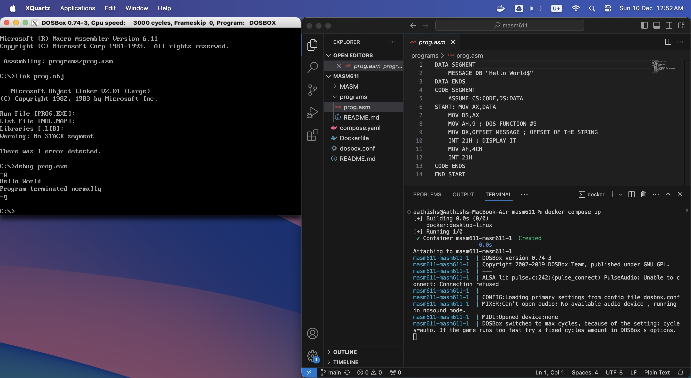

@ [anonimbus/docker-dos-masm_611](https://github.com/Anonimbus/docker-dos-masm_611)
@ [Aathish04/docker-masm611](https://github.com/Aathish04/docker-masm611)

This is the **amd-version** for the arm docker image [aathish04/masm611](https://hub.docker.com/repository/docker/aathish04/masm611/general)
 by [Aathish04](https://github.com/Aathish04/docker-masm611)

This repository provides the Dockerfile for the [anonimbus01 Docker Image](https://hub.docker.com/repository/docker/anonimbus01/dos_masm_611/general), as well as a `compose.yaml` for ease of use of the image.

**IMPORTANT NOTE:
This repository is not an "official" repository.**

Briefly, the Image generated through the Dockerfile here provides:
- MASM v6.11 (`MASM.EXE`)
- Microsoft Object Linker v2.01 (Large) (`LINK.EXE`)
- Microsoft MS-DOS Debugger v2.40 (`DEBUG.EXE`)
- EdIt! 1.2 by SRT Enterprises (`EDIT.EXE`) 
- DOSXNT MSOFT1 By Phar Lap Software Inc. (`DOSXNT.EXE`)
- Microsoft Macro Assembler and Linker (presumably v6.11) (`ML.EXE` and `ML.ERR`)

## Prerequisites for Use
1) You have Docker Desktop installed.
2) You have a running X Window Server (such as XQuartz) running on your host, and it is configured to accept connections from localhost.

## Getting Started
1) Clone this repository to your local system.
2) Move into this directory.
3) Place your assembly source programs inside the `programs` folder.
4) For ARM/MAC users you change the compose.yaml file to
```bash
    masm611:
        image: aathish04/masm611:latest
```
unlike for windows users
```cmd
    dos_masm_611:
        image: anonimbus01/dos_masm_611:latest
```

For **linux users**, or if you want to build manually, on this repo's folder do:
```bash
    docker build -t <image_name>:<tag> .
```
example:
```bash
    docker build -t dos_masm_611:full .
```
5) Run `docker compose up`.

    You should see a DOSBOX window open up with the `C:` drive as the current working directory. You may read the [Program Execution ReadMe](programs/README.md) for more info on the very basics of using MASM with this setup.
    

6) Once you're done with MASM (say, at the end of your semester) you can delete both the `masm611 Docker Compose Project` and the `masm611 Docker Image` through the Docker Desktop dashboard.

## Contribution

Is welcome. Issues and bug reports, as well as pull requests are highly encouraged.

# DISCLAIMER

This repository is in NO WAY AFFILIATED WITH MICROSOFT, SRT ENTERPRISES, PHAR LAP SOFTWARE INC OR ANY OTHER CORPORATE ENTITY WHOSE CODE MAY HAVE FOUND ITS WAY INTO THE REPOSITORY. THIS IS NOT AN OFFICIAL DISTRIBUTION OF ANY OF THE SOFTWARE SHARED.
